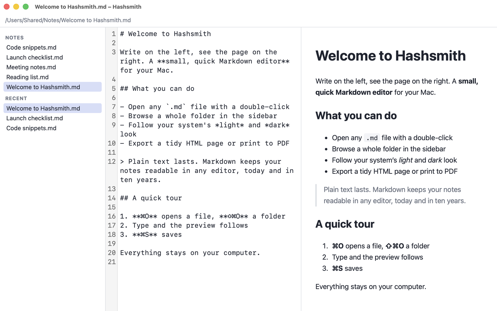
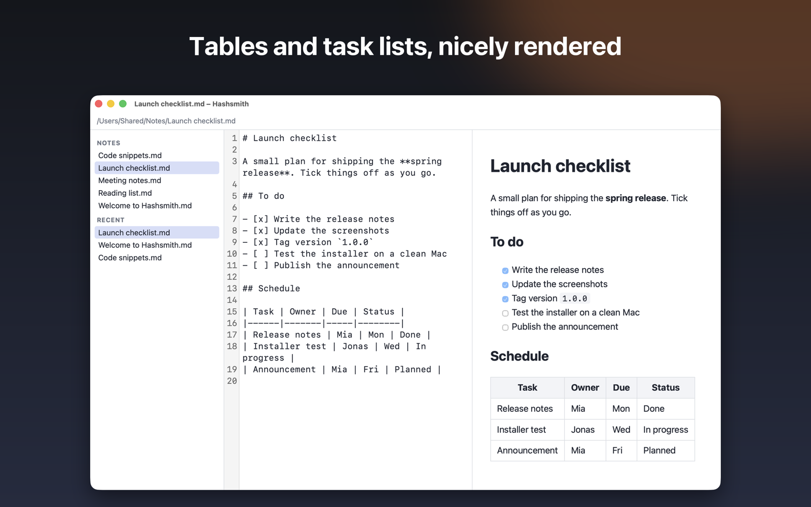
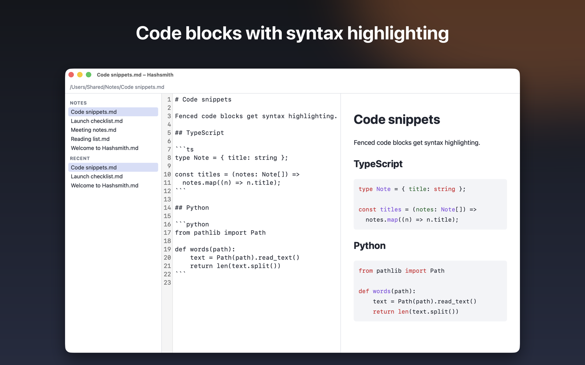
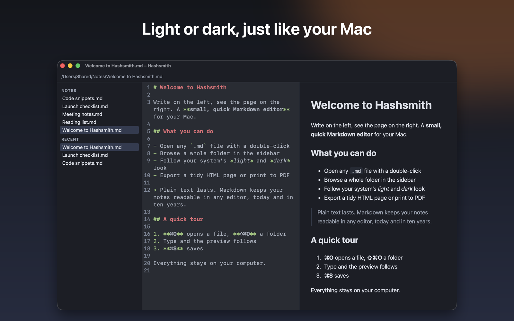
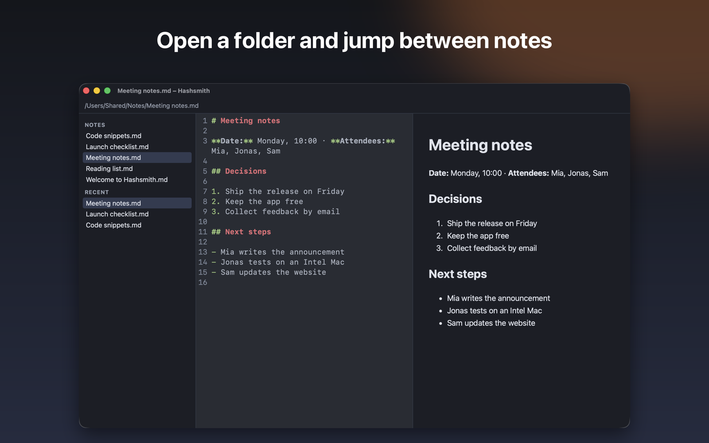

  

<h1 align="center">Hashsmith</h1>

  <strong>Shape your Markdown.</strong> 
  A small, quick Markdown editor for macOS and Linux. Write on the left, see the finished page on the right.

  <a href="../../releases/latest"><b>⬇️ Download the latest release</b></a>
  &nbsp;·&nbsp;
  <a href="https://hashsmith.dev">Website</a>
  &nbsp;·&nbsp;
  <a href="https://hashsmith.dev/de/">Deutsch</a>

  
  
  

  <picture>
    <source media="(prefers-color-scheme: dark)" srcset="img/app-dark.png">
    
  </picture>

## Why Hashsmith

- **Live preview.** Source on the left, rendered page on the right. Tables, task lists and code blocks with syntax highlighting.
- **Native.** The real menu bar with the shortcuts you know. It uses the system web view instead of shipping a browser, so the macOS app is about 10 MB.
- **Light and dark.** Editor, preview and export follow your system appearance.
- **Folders and recent files.** Open a folder, browse its Markdown files in a sidebar and jump back to what you edited last.
- **Export.** Save a self-contained HTML page, or print to PDF through the system dialog.
- **Private.** It works offline and sends nothing anywhere. Your documents stay on your computer.

## A look around

<table>
  <tr>
    <td width="50%"></td>
    <td width="50%"></td>
  </tr>
  <tr>
    <td width="50%"></td>
    <td width="50%"></td>
  </tr>
</table>

## Install

Grab the file for your system from the **[latest release](../../releases/latest)**.

### macOS (13 Ventura or later, Apple silicon and Intel)
1. Download the `.dmg`, open it and drag **Hashsmith** onto *Applications*.
2. Start it. The app is signed and notarized by Apple, so there is no Gatekeeper warning.

A Mac App Store version is on its way.

### Linux (64-bit)
| Package | Install |
|---|---|
| `.AppImage` | `chmod +x Hashsmith_*.AppImage && ./Hashsmith_*.AppImage` |
| `.deb` (Debian, Ubuntu) | `sudo apt install ./Hashsmith_*_amd64.deb` |
| `.rpm` (Fedora, openSUSE) | `sudo dnf install ./Hashsmith-*.rpm` |

The packages need WebKitGTK 4.1 (`libwebkit2gtk-4.1`). The Linux builds are new and have seen less testing than the macOS app. If something does not work, please [open an issue](../../issues) or write to <contact@hashsmith.dev>.

## Keyboard shortcuts

| Action | macOS | Linux |
|---|---|---|
| Open file | `⌘O` | `Ctrl+O` |
| Open folder | `⇧⌘O` | `Ctrl+Shift+O` |
| Save / Save as | `⌘S` / `⇧⌘S` | `Ctrl+S` / `Ctrl+Shift+S` |
| Export as HTML | `⇧⌘E` | `Ctrl+Shift+E` |
| Print / Save as PDF | `⌘P` | `Ctrl+P` |
| Show or hide the sidebar | `⇧⌘B` | `Ctrl+Shift+B` |
| Larger / smaller / actual text size | `⌘+` / `⌘-` / `⌘0` | `Ctrl+` / `Ctrl-` / `Ctrl+0` |

## Support

Hashsmith is free and always will be. If it saves you time, a small donation helps me keep building it: **[github.com/sponsors/alexelmi](https://github.com/sponsors/alexelmi)**.

## About this repository

This repository only hosts the download files (see [Releases](../../releases)) and this page. Hashsmith's source code is in a private repository. Questions, bug reports and ideas are welcome in the [issues](../../issues) or at <contact@hashsmith.dev>.
